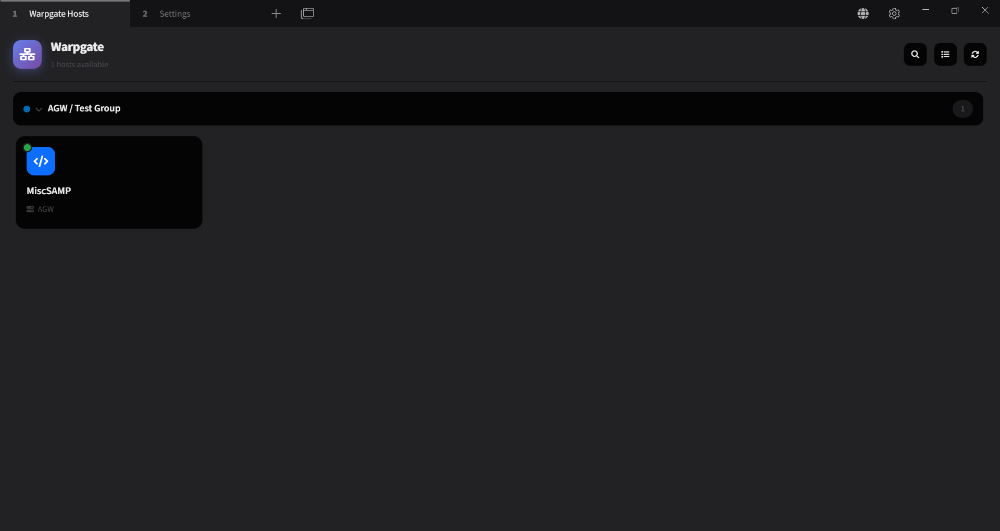

# Tabby Warpgate Plugin

[](https://www.npmjs.com/package/tabby-warpgate)
[](https://opensource.org/licenses/MIT)

A comprehensive Warpgate SSH gateway integration for [Tabby Terminal](https://tabby.sh/). Connect to SSH hosts through Warpgate with one click - similar to Termius but integrated directly into Tabby.



## Features

- **Multiple Warpgate Server Support** - Connect to multiple Warpgate instances simultaneously
- **One-Click SSH Connections** - Connect to any Warpgate target with a single click
- **Quick Search (Ctrl+K)** - VS Code-style command palette for instant host search and connection
- **Pinned Hosts / Favorites** - Pin frequently-used hosts to the top for quick access
- **Dual View Modes** - Switch between card grid view and compact list view
- **Automatic Authentication** - Authenticate once, connect to all targets
- **Automatic OTP** - Built-in TOTP support for two-factor authentication
- **Host Grouping & Search** - Organize and find hosts quickly
- **Auto-Refresh** - Keep host lists up to date automatically
- **Toolbar Quick Access** - Fast access to all hosts via toolbar button
- **Full Settings UI** - Easy configuration through Tabby settings
- **Debug Mode** - Troubleshoot connection issues with detailed logging
- **Cross-Platform** - Works on Tabby Desktop (Windows, macOS, Linux) and Tabby Web

## Installation

### From Plugin Manager (Recommended)

1. Open Tabby
2. Go to Settings > Plugins
3. Search for "warpgate"
4. Click Install

### Manual Installation

```bash
# Clone the repository
git clone https://github.com/0x416c69/tabby-warpgate.git
cd tabby-warpgate

# Install dependencies and build
npm install
npm run build

# Install to Tabby's plugins directory
# Windows: %APPDATA%\tabby\plugins
# macOS: ~/Library/Application Support/tabby/plugins
# Linux: ~/.config/tabby/plugins

cd /path/to/tabby/plugins
npm install /path/to/tabby-warpgate
```

## Quick Start

### Adding a Warpgate Server

1. Open Tabby Settings
2. Go to the **"Warpgate"** tab
3. Click **"Add Server"**
4. Enter your Warpgate server details:
   - **Server Name**: A friendly name for this server
   - **Server URL**: The HTTPS URL (e.g., `https://warpgate.example.com`)
   - **Username**: Your Warpgate username
   - **Password**: Your Warpgate password
5. Click **"Test Connection"** to verify
6. Click **"Add Server"** to save

### Connecting to Hosts

#### Quick Search (Recommended)
Press **Ctrl+K** (or **Cmd+K** on Mac) to open the quick search modal:
- Type to filter hosts by name, server, or group
- Use **Arrow keys** to navigate
- Press **Enter** to connect
- Press **Escape** to close

#### Via Hosts Panel
1. Click the Warpgate icon in the toolbar (or go to the Warpgate tab)
2. Browse hosts organized by groups
3. Click any host card to connect via SSH

#### Pinning Favorites
- Hover over a host and click the **star icon** to pin it
- Pinned hosts appear at the top of all lists
- Great for frequently-used servers

#### View Modes
Toggle between **Grid View** (cards) and **Compact View** (list) using the toggle button in the header.

## How It Works

### One-Click Authentication (Ticket-Based)

This plugin uses Warpgate's **ticket system** for truly one-click SSH connections:

1. When you add a server, the plugin stores your credentials in Tabby's configuration
2. On startup, the plugin authenticates with all enabled servers
3. When you click to connect:
   - Creates a **one-time ticket** for that specific target
   - Uses the ticket secret as the SSH username (`ticket-<secret>`)
   - **No password prompt!** The ticket authenticates you automatically
4. Tickets are cached and automatically cleaned up after use

### Fallback Authentication (Password + OTP)

If ticket creation fails (e.g., user lacks admin/ticket permissions), the plugin automatically falls back to traditional authentication:

1. **Username format**: `warpgate_user:target_name`
2. **Password**: Automatically provided from stored credentials
3. **OTP**: If two-factor is required, the plugin automatically generates and submits the TOTP code

This means even non-admin users get a seamless one-click experience - just click and connect!

### Automatic OTP Support

If your Warpgate requires two-factor authentication:

1. Go to Settings > Warpgate
2. Select your server and click **"Auto-Setup OTP"**
3. The plugin will automatically:
   - Generate a secure TOTP secret
   - Register it with your Warpgate account
   - Store it locally for automatic code generation
4. All future connections will automatically provide OTP codes - no manual entry needed!

**Manual Setup**: If you already have OTP configured, you can enter your existing TOTP secret (Base32 key) in the server settings.

### Security Note

Credentials (passwords and OTP secrets) are stored in **plain text** within Tabby's configuration file (`config.yaml`). This is consistent with how Tabby stores other sensitive data like SSH passwords. Keep your Tabby configuration file secure and avoid sharing it.

## Configuration Options

| Option | Description |
|--------|-------------|
| **Auto-refresh Interval** | How often to refresh the host list (disabled, 30s, 1m, 5m, 10m) |
| **Show Offline Servers** | Show servers that are not connected |
| **Group by Server** | Group hosts by their Warpgate server |
| **Sort by** | Sort hosts by name, server, type, or group |
| **Debug Mode** | Enable detailed logging for troubleshooting |

## Keyboard Shortcuts

| Shortcut | Action |
|----------|--------|
| **Ctrl+K** / **Cmd+K** | Open Quick Search |
| **Arrow Up/Down** | Navigate search results |
| **Enter** | Connect to selected host |
| **Escape** | Close quick search |

## Development

### Prerequisites

- Node.js 18+
- npm

### Setup

```bash
# Install dependencies
npm install

# Build
npm run build

# Watch mode (for development)
npm run watch

# Run tests
npm test

# Lint
npm run lint
```

### Project Structure

```
tabby-warpgate/
├── src/
│   ├── api/                 # Warpgate API client
│   ├── components/          # Angular components
│   ├── models/              # TypeScript interfaces
│   ├── providers/           # Tabby providers
│   ├── services/            # Angular services
│   ├── utils/               # Utility functions
│   ├── __tests__/           # Unit tests
│   └── index.ts             # Plugin entry point
├── dist/                    # Build output
├── package.json
├── tsconfig.json
├── webpack.config.js
└── jest.config.js
```

### Testing Your Plugin

```bash
# Run Tabby with your plugin in development
# The path should be the parent directory containing your plugin folder

# Windows PowerShell
$env:TABBY_PLUGINS = (Get-Item .).Parent.FullName; tabby --debug

# Linux/macOS
TABBY_PLUGINS=$(dirname $(pwd)) tabby --debug
```

## Troubleshooting

### Connection Issues

| Problem | Solution |
|---------|----------|
| "Connection refused" | Check that Warpgate is running and accessible |
| "Authentication failed" | Verify username and password |
| "No targets available" | Ensure your user has roles assigned to targets |
| "Certificate error" | Enable "Trust Self-Signed" option |

### Plugin Not Loading

1. Ensure the plugin is installed via npm (not just copied)
2. Check `%APPDATA%\tabby\plugins\package.json` - plugin should be listed
3. Verify `dist/index.js` exists
4. Open DevTools (Ctrl+Shift+I) and check for errors

### Debug Mode

Enable Debug Mode in Settings > Warpgate to see detailed logs in the console.

## API Reference

The plugin exports classes that can be used by other plugins:

```typescript
import {
  WarpgateService,
  WarpgateApiClient,
  WarpgateProfileProvider,
  WarpgateServerConfig,
  WarpgateTarget,
} from 'tabby-warpgate';
```

## Contributing

1. Fork the repository
2. Create a feature branch (`git checkout -b feature/amazing-feature`)
3. Make your changes
4. Run tests (`npm test`)
5. Commit your changes (`git commit -m 'Add amazing feature'`)
6. Push to the branch (`git push origin feature/amazing-feature`)
7. Open a Pull Request

## License

MIT License - see [LICENSE](LICENSE) file for details.

## Credits

- [Tabby Terminal](https://tabby.sh/) - The amazing terminal emulator
- [Warpgate](https://github.com/warp-tech/warpgate) - Smart SSH bastion host

## Support

- [GitHub Issues](https://github.com/0x416c69/tabby-warpgate/issues)
- [Tabby Discord](https://discord.gg/tabby)
